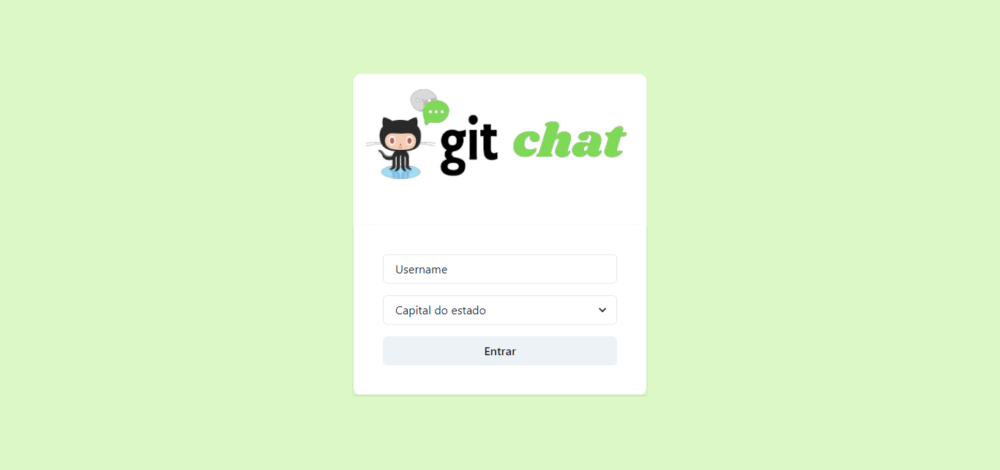
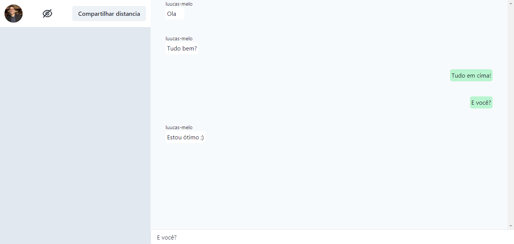
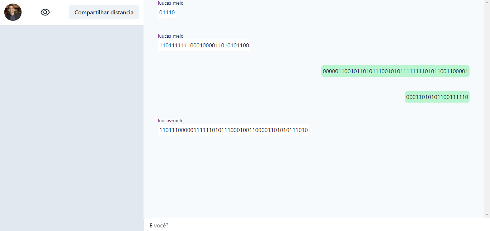
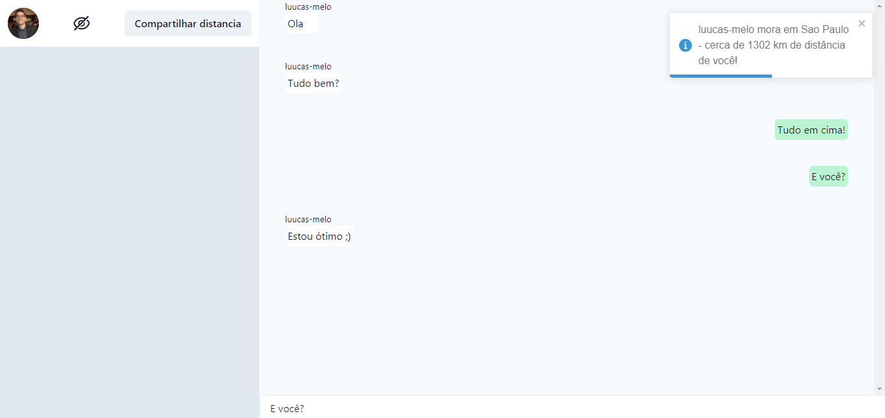
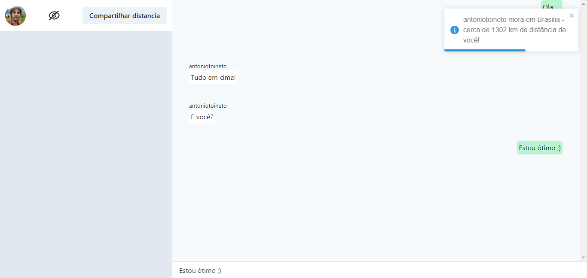
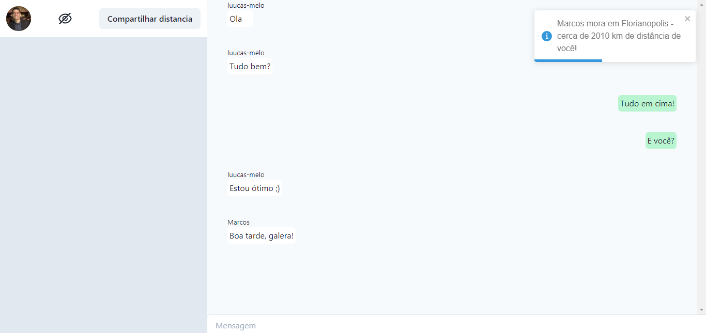

# Git Chat 

**Número da Lista**: 6<br>
**Conteúdo da Disciplina**: Trabalho Final<br>

## Alunos
|Matrícula | Aluno |
| -- | -- |
| 19/0044799  |  Antônio Ferreira de Castro Neto |
| 18/0125885  |  Lucas Melo dos Santos |

## Sobre 
O projeto Git Chat se trata de uma plataforma de chat utilizando um WebSocket, na qual o usuário pode acessar com seu *username* do Github. A partir disso, o usuário pode interagir com outras pessoas que acessarem o chat, mandando mensagens ou compartilhando a sua localização. 

Além disso, o projeto faz a compressão da mensagem enviada utilizando o **algoritmo ambicioso de Huffman**, e também calcula a distância entre os integrantes do chat utilizando **grafos** e o algoritmo de **Dijkstra**.

## Screenshots
## Tela inicial



## Compressão de mensagem (Huffman)
Mensagem normal | Mensagem comprimida
:-----------------------:|:-----------------------:
  |  

### Mensagem normal


### Mensagem comprimida


## Compartilhando localização (Dijkstra)
Mensagem normal | Mensagem comprimida
:-----------------------:|:-----------------------:
  |  

### Lucas compartilhando com Antonio


### Antonio compartilhando com Lucas


## 3º pessoa no chat


<!---->

## Instalação 
**Linguagem**: Java Script<br>
**Framework**: React JS<br>
**Pré-requisitos:**
* ter instalado na máquina **yarn** ou **npm**.

## Uso 
* Após clonar o repositório em sua máquina e acessa-lo:

```
cd git-chat

yarn install

yarn dev
```
ou 
```
cd git-chat

npm install

npm dev
```

## Outros 
Esse projeto utiliza o nextjs para rodar o backend do projeto, portanto deve ser utilizado o comando *yarn dev* em vez de *yarn start*.


